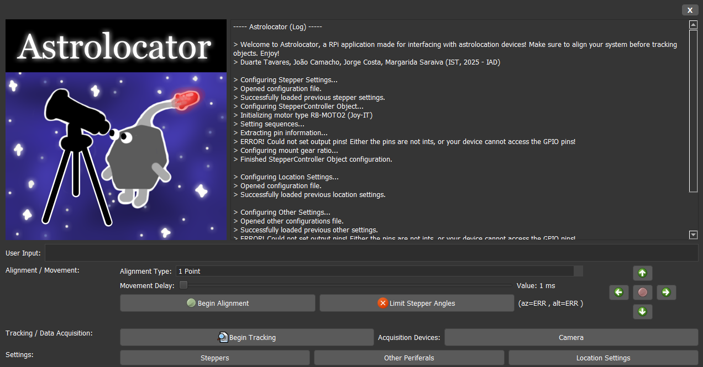

# Instrumentation and Data Acquisition Projects

This repository contains two projects that were developed as part of the Instrumentation and Data Acquisition course in the BSc. of Engineering Physics @ Instituto Superior Técnico.

Both projects were developed over the course of 8 weeks, and involved circuitry, communication between controller boards like Arduino and Raspberry Pi, and the acquisition of physical quantities (images, voltages, ...).

# Arduino Interface

The first project, *Arduino Interface*, was developed in the first two weeks.

It consists of a GUI application for a RPi / Regular computer which is connected to an Arduino, and is used to send instructions and receive gathered data.

The applications allows for the control of programme variables through commands (written in a text input bar with terminal-like functionalities like accessing previously sent commands), plotting data and provides a text window with the command descriptions, which also shows the commands implemented in the Arduino. Commands which only affect the programme are called 'internal'; commands which are entirely processed by the Arduino are called 'external'; finally, commands which use both commands (example: data gathering routines) are called 'mixed'. The applications also provides a console log, a run and interrupt button.

The application is inside the 'Arduino Interface' folder.

# Astrolocator

The second project, *Astrolocator*, was developed in the subsequent weeks.

It consists of a GUI application for a RPi, which is used to control various periferals - a camera, a laser and 2 stepper motors. These periferals can then be assembled using 3D printed parts, which are also provided in the stl folder, to build a versatile astronomical object tracker - to point to objects using the laser, take pictures, or even support a custom printed telescope mount (not currently provided).

The programme provides a user log and input console, manual stepper movement controls, an alignment feature (which allows for 1 point or N>3 point alignment, providing objects from astronomy databases like Simbad and Horizons for the calibration), a stepper angle limiter (to account for any physical impediments), a tracking feature (which allows for the tracking of objects in Simbad, Horizons or N2YO - note for N2YO: must set API key environment variable to use!), a camera window (allowing for the capture of pictures with configurable exposition), and various settings windows to configure the stepper, the laser and location settings.

The application is inside the 'Astrolocator' folder.

